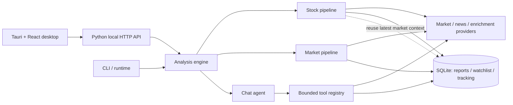
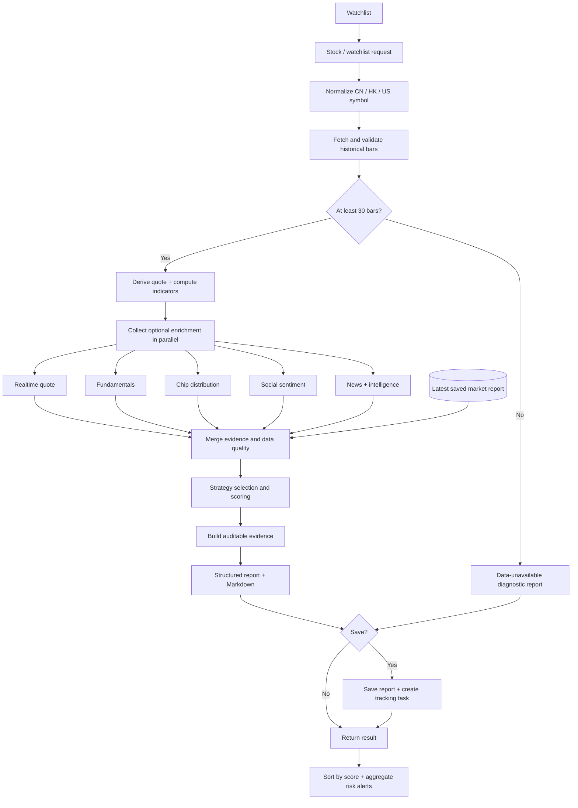
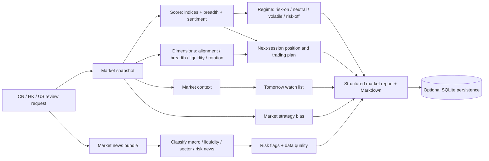
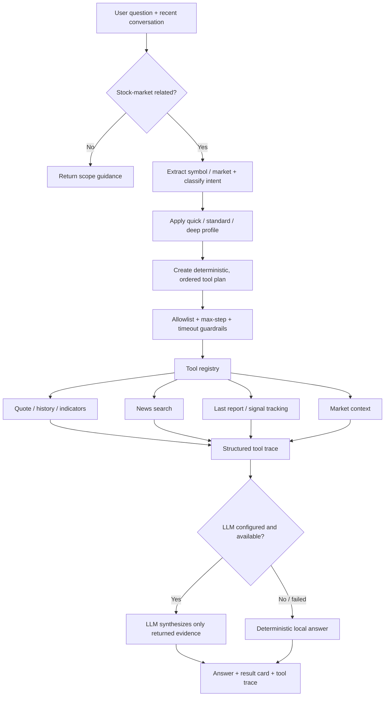
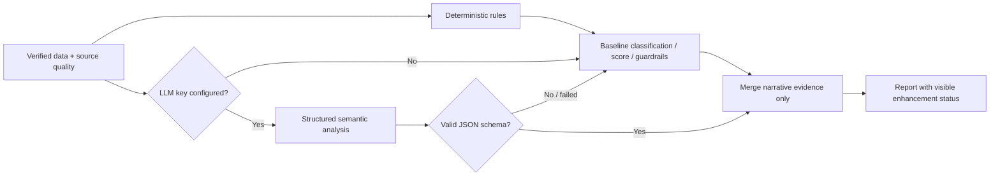

# Trading Journal

Trading Journal is a Tauri desktop stock research workstation. It focuses on a closed research loop:

```text
collect market and stock information
-> strategy analysis
-> structured report
-> follow-up performance tracking
-> review and improve decisions
```

It borrows a proven technical direction, but uses a different product shape and a smaller codebase:

- Tauri desktop app
- Rust shell for local process management
- Python local core API
- SQLite storage
- fixed pipelines for automated watchlist and market analysis
- ReAct only for flexible chat questions

## Architecture

```text
desktop/                 Tauri + React workspace
engine/
  app.py                 Local HTTP API
  config.py              Runtime settings
  runtime.py             CLI/runtime helpers
  data/                  Quotes, history, market context and news
  indicators/            Trend, momentum, volume, levels, chips
  strategies/            Strategy registry and builtin yaml files
  agent/                 Lightweight ReAct loop and tools
  analysis/              Stock pipeline, market pipeline, reports, tracking
  storage/               SQLite access and migrations
  tests/                 Core tests
```

## Main Workflows

The desktop and CLI share the same local engine. Stock and market analysis use
fixed pipelines so that data collection, scoring and persistence stay
reproducible; chat uses a bounded agent flow to choose read-only research tools
and summarize their evidence.



### Watchlist Pipeline

Stable and deterministic. It validates history first, computes indicators, then
combines independently degradable realtime, fundamental, chip, sentiment and
news inputs with strategy evidence. Report generation does not depend on an
LLM.



### Market Review Pipeline

Fixed flow for CN, HK and US market review. Output follows a structured schema with market regime, score, indices, breadth, sector rotation, macro news, risk flags and tomorrow watch.



### Chat

Chat uses a small ReAct loop because user questions are open-ended. Tools include quote, history, indicators, news, last report, signal tracking and market context.



The chat model does not freely call providers: intent parsing and the selected
profile determine an allowlist, calls execute in a fixed order with a bounded
step count and timeout, and the LLM is used only for final evidence synthesis.

### Optional Natural-language Enhancement

Stock and market reports use rules as the authoritative baseline. When an LLM
key is configured, the engine automatically analyzes evidence that benefits
from semantic reasoning:

- news event direction, expectation gaps and likely impact horizon
- social-sentiment meaning and reliability
- relationships between fundamentals, market context and strategy evidence
- cross-evidence conflicts, catalysts, risks and follow-up conditions

The enhancement must return a validated JSON object. It can add narrative
evidence, risks and watch conditions, but cannot change prices, technical
indicators, market/stock scores, targets or position sizing. Missing
configuration, empty evidence, timeout, provider failure or invalid JSON all
fall back to the original rule result.



## Run

### Prerequisites

- Python 3.10 or later installed in the Conda environment named `tj`. Verify it
  with `conda run -n tj python --version`.

Install all providers and the engine together (there are no optional provider extras):

```powershell
conda run -n tj python -m pip install -e .
```

Engine only:

```powershell
conda run -n tj python -m engine.app
```

Command-line analysis:

```powershell
# Analyze a single stock
conda run -n tj python -m engine.runtime --stock AAPL

# Analyze multiple watchlist symbols
conda run -n tj python -m engine.runtime --watchlist AAPL MSFT 600519

# Analyze a market (cn, hk, or us)
conda run -n tj python -m engine.runtime --market cn
```

The commands print analysis results directly to the terminal. After installing the
project with `pip install -e .`, `tj-runtime` can be used instead of
`python -m engine.runtime`.

Desktop:

```powershell
cd desktop
npm install
npm run tauri:dev
```

## Standalone releases

Release builds bundle the Python engine as a Tauri sidecar, so users do not
need Python or Conda. Application data and credentials are stored in the
operating system's per-user application data directory.

To publish installers for Windows and macOS:

1. Update the version in `desktop/src-tauri/tauri.conf.json`,
   `desktop/src-tauri/Cargo.toml`, and `desktop/package.json`.
2. Push a matching tag, for example `v0.2.0`.
3. The `Release desktop app` GitHub Actions workflow builds the Python sidecar
   on each operating system and uploads the Tauri installers to a GitHub
   Release.

The workflow can also be started manually. Manual runs build downloadable
workflow artifacts without creating a GitHub Release.

For a local release build, install PyInstaller in the `tj` environment first,
then run:

```powershell
conda run -n tj python -m pip install "pyinstaller>=6.11,<7"
conda run -n tj python tools/build_sidecar.py
cd desktop
npm run tauri:build
```

All LLM, market-data and news credentials are managed only on the desktop Settings page. Environment variables are not read. Providers are tried in capability order and validated by their real response; when every source fails, the report lists missing sources and remediation instead of falling back to sample data.
